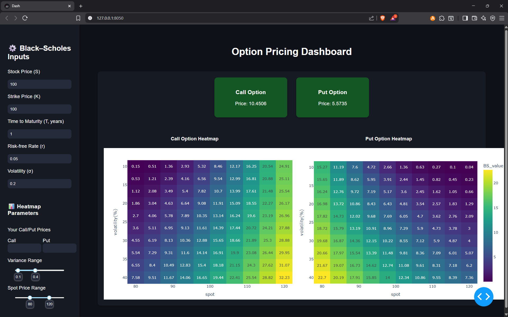

# Black-Scholes-Option-Pricer
Web-based dashboard built with Dash and QuantLib to price European call and put options using the Black–Scholes–Merton model. It provides option valuation, adjustable parameters, and interactive heatmaps that visualize price sensitivity to volatility and spot price. Designed for quantitative finance learners and traders to explore option dynamics.  

#### Visit https://black-scholes-option-pricer-gkdd.onrender.com to check it out. (May take some time to load initially...)

## 🚀 Features
- Real-time computation of **Call** and **Put** option prices  
- Interactive **heatmaps** showing sensitivity to volatility and spot  
- Adjustable inputs for **S, K, r, σ, T**  
- Built with **Python**, **Dash**, **Plotly**, and **QuantLib**

---

## 📁 Project Structure
Black-Scholes-Option-Pricer/
├── assets/  
│ ├── style.css  
│ └── preview.png  
│── app.py  
│── utils.py  
│── requirements.txt  
│── environment.yml  
└── README.md  
  
---  
  
## ⚙️ Installation  

### 1️⃣ Using Conda
```bash
git clone https://github.com/AnjaneeyaB/Black-Scholes-Option-Pricer.git
cd Black-Scholes-Option-Pricer
conda env create -f environment.yml
conda activate blackScholesPricer
python app.py
```
  
### 2️⃣ Using Pip
```bash
git clone https://github.com/AnjaneeyaB/Black-Scholes-Option-Pricer.git
cd Black-Scholes-Option-Pricer
```
Create a Virtual Environment with Python (3.13.9), and activate it.
```bash
pip install -r requirements.txt
python app.py
```  

## 
## 📸 Example Screenshot  
  
    
## 📦 Dependencies  
  Python = 3.13.9    
  Dash = 2.14.2  
  Plotly = 6.3.0  
  QuantLib = 1.40  
  Pandas = 2.3.3  
  NumPy = 2.3.3  
  
## 📜 License  
  
This project is licensed under the MIT License.  
You are free to use, modify, and distribute it with attribution.
    
## 👤 Author  
  
Anjaneeya B  
GitHub: @AnjaneeyaB  
  
“In investing, what is comfortable is rarely profitable.” — Robert Arnott


